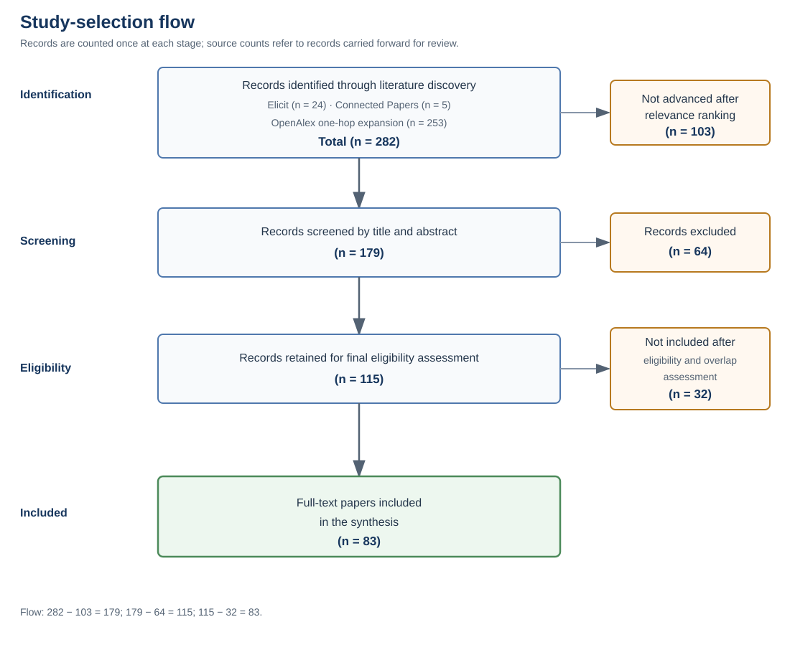
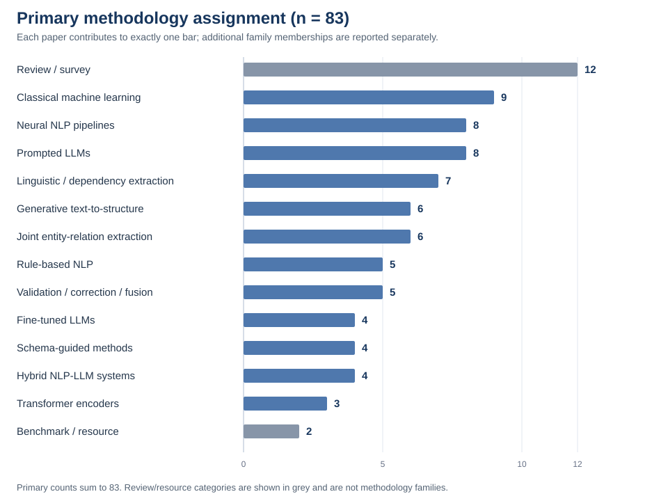

# From Rules to Large Language Models: A Review of Methods for Constructing Knowledge Graphs from Unstructured Text

**Authors:** Atanas Vitanov, Andrej Damjanovski, Trajce Prodanov, Rade Perovanovikj 
**Affiliation:** Faculty of Computer Science and Engineering, Ss. Cyril and Methodius University in Skopje

## Abstract

Knowledge graphs store facts as things and the links between them, but much useful knowledge is still written in ordinary text. Turning that text into a reliable graph involves more than producing triples. A system must find the things mentioned in the text, identify their links, decide when different names refer to the same thing, match the facts to the graph's structure, merge repeated facts, and check the result. This review brings together 83 full-text studies and follows the field from language rules and statistical methods to neural networks, transformers, and large language models (LLMs). The main change over time is where systems place their rules and limits: in hand-written patterns, training data, prompts, output formats, or checking steps. No method covers the full process without important weaknesses. Rules are easy to inspect but narrow. Trained models perform well on familiar tests but depend on labeled data and fixed relation types. LLMs are flexible, but their results can change with the prompt, include unsupported facts, cost more to run, and create privacy concerns. The strongest practical pattern combines broad extraction with a clear graph structure, stable entity names, source records, fixed checks, confidence scores, or human review. Because studies test different tasks and use different definitions of a correct result, their scores cannot always be compared directly. The review assigns every paper one primary and any additional methodology families, appraises clear methodological limitations, and audits code, data, and model-version reporting. It explains those differences and suggests how Text-to-Knowledge-Graph systems can become more reliable and easier to maintain.

**Keywords:** knowledge graph construction; information extraction; relation extraction; entity linking; open information extraction; transformers; large language models; ontology; knowledge fusion; graph validation

## 1. Introduction

Scientific, technical, administrative, and public knowledge is largely written in natural language. A knowledge graph turns some of that knowledge into a form that a computer can search and connect. It stores entities—such as people, drugs, places, or events—and relations between them. For example, the sentence “this drug treats this disease” can become a triple that links the drug to the disease through a `treats` relation. Reliable construction still requires several decisions: where an entity name starts and ends, whether two names refer to the same thing, which relation is stated, whether the fact fits the graph's structure, and whether the source supports it. One early error can affect every later step.

Several terms appear throughout the review. A **schema** describes the types of entities and relations allowed in a graph. An **ontology** adds shared meanings and rules for a subject area. **RDF** is a common way to store a fact as a subject, relation, and object. **Entity linking** connects a name in text to a stable record, such as a Wikidata entry. **Coreference resolution** decides that phrases such as “the company” and a company name refer to the same entity.

The literature approaches this problem through rules, language analysis, open information extraction (OpenIE), classical machine learning, neural networks, transformers, joint extraction, generative models, and LLMs (Zhong et al., 2022; Ye et al., 2022; Bottino and Alcázar, 2026). Other studies focus on entity linking, matching facts to an ontology, confidence scores, merging, checking, and testing. These areas are often tested on different datasets and at different steps of the process, so a simple ranking of all models would be misleading.

The expected output also differs. Some systems return a list of relations from one sentence. Others produce RDF, ontology elements, or a graph stored in tools such as Neo4j. A score for extracted triples may therefore measure only one part of the final result. A graph used over time also needs stable identifiers, consistent meanings, records of where each fact came from, removal of duplicates, and clear rules for correction. These extra needs explain why a strong extraction score does not always lead to a useful graph.

Newer methods have not fully replaced older ones. Instead, rules have moved from hand-written patterns, dictionaries, and ontologies into training data, prompts, output formats, search tools, and checking steps. Modern systems often add clear rules back after generation because fluent text is not always factual or valid for a graph. This review therefore asks four connected questions: which methods and process stages are covered; how the field has changed; how systems are tested and what their strengths and limits are; and which improvements and research problems remain.

The review combines findings across papers rather than listing one summary after another. Its main argument is that flexible extraction is useful only when a system also controls identity, graph structure, source tracking, and factual quality.

### 1.1 Contribution relative to earlier reviews

This review is not broader than every predecessor and does not claim to be. Zhong et al. cover more than 300 methods across heterogeneous inputs and the full knowledge-graph lifecycle, while Bottino and Alcázar include 126 LLM-focused primary studies. The distinct contribution here is to apply one Text-to-KG pipeline and one multi-label methodology scheme across older rules, statistical and neural extraction, generative models, and recent LLM systems, then connect that classification to study-level evaluation weaknesses and reproducibility reporting. Table 1 makes the boundary explicit.

*Table 1. Scope and contribution relative to related reviews.*

| Review | Main scope and organizing principle | Difference in the present review |
| --- | --- | --- |
| Zhong et al. (2022) | More than 300 methods for acquisition, refinement, evolution, and storage across heterogeneous data | Narrows the input to unstructured text, includes post-2022 LLM research, and audits evaluation and reproducibility at paper level |
| Ye et al. (2022) | Generative KGC, organized by five output-generation paradigms; empirical summaries concentrate on NYT and ACE-2005 | Places generative methods beside non-generative predecessors and downstream identity, schema, fusion, and validation responsibilities |
| Bottino and Alcázar (2026) | PRISMA-based scoping review of 126 LLM studies, grouped as RDF-, prompt-, RAG-, and hybrid approaches; search dated 31 March 2025 | Uses a finer twelve-family, multi-label classification and compares LLM systems with rule-based, statistical, neural, and transformer methods under the same evaluation lens |
| Hong and Huang (2026) | Narrative survey linking Seq2Seq generation with LLM-era ontology construction, extraction, and fusion | Adds non-generative families, a six-responsibility Text-to-KG pipeline, per-paper family assignments, and explicit methodological-quality and reproducibility audits |

The corpus contains papers published through August 2026. This recent search cut-off complements the review's methodological classification, evaluation appraisal, and reproducibility analysis, but recency is not presented as its sole contribution.

## 2. Review method

### 2.1 Evidence base and eligibility

The review analyzed 83 full-text papers concerned with transforming natural-language text into entities, relations, triples, schemas, or knowledge graphs. This set constitutes the complete evidence base used in the synthesis.

A study was included when it used unstructured natural-language text as input and produced information that could directly build or add facts to a graph. Studies focused on relation extraction or entity linking were included when their output formed a clear part of the Text-to-KG process. Benchmarks and substantial surveys were included when they helped explain testing methods or historical development. Work that only searched, embedded, completed, or reasoned over an existing graph was excluded unless it also created graph content from text.

The search protocol combined three complementary discovery sources and covered literature available through August 2026. Elicit supported semantic retrieval across the review's methodology and evaluation themes. Connected Papers supported similarity-based exploration from relevant seed records, while OpenAlex provided bibliographic verification and controlled backward-, forward-, and related-work expansion. Publisher, proceedings, DOI, arXiv, DBLP, and institutional-repository pages were used for metadata verification and document consultation rather than as separate discovery sources.

Nineteen focused natural-language formulations were used in Elicit to cover surveys, rule-based and statistical methods, neural and transformer extraction, joint and generative methods, LLM prompting and fine-tuning, ontology and schema constraints, hybrid pipelines, validation and fusion, benchmarks, and graph-level evaluation. The formulations required unstructured natural-language input and graph-compatible output and excluded work limited to GraphRAG, knowledge-graph question answering, embeddings, link prediction, completion, graph-to-text generation, or use of an existing graph. Table 2 presents representative formulations; Supplementary Table S1 provides the complete search strategy.

*Table 2. Examples of the Elicit search formulations.*

| Search focus | Example search formulation |
| --- | --- |
| Surveys | What surveys and systematic reviews describe methods for constructing knowledge graphs from unstructured natural-language text? |
| Rules and OpenIE | Which original research papers introduce rule-based, pattern-based, dependency-parsing, or Open Information Extraction methods for extracting entities, relations, or triples from unstructured text for knowledge graph construction? |
| Transformers | Which original research papers use transformer encoder models such as BERT for entity extraction, relation extraction, or joint entity–relation extraction from unstructured text for knowledge graph construction? |
| Generative methods | Which original research papers use generative sequence-to-sequence, text-to-triple, or text-to-graph methods to transform unstructured natural-language text into structured knowledge graph output? |
| Prompted LLMs | Which original research papers use zero-shot or few-shot large language model prompting to construct knowledge graphs from unstructured natural-language text? |
| Ontology and schema guidance | Which original research papers use ontologies, schemas, or controlled relation vocabularies to guide the construction of knowledge graphs from unstructured natural-language text? |
| Validation and integration | Which original research papers validate, correct, deduplicate, link, or integrate knowledge graph triples extracted from unstructured text? |
| Benchmarks | Which original research papers introduce benchmarks or datasets for evaluating systems that transform unstructured natural-language text into knowledge graph triples or graph structures? |

The semantic searches contributed 24 candidate records, and seed-based exploration contributed five additional records. Overlap between these outputs was resolved using bibliographic identifiers and normalized titles before expansion. The OpenAlex stage followed a controlled, non-recursive, one-hop design. For each bibliographically matched origin, up to 100 referenced works, 20 citing works, and 20 related works were inspected, with no more than five records retained from each channel after relevance ranking. Consolidation by OpenAlex identifier, DOI, and normalized title reduced 309 origin–relationship observations to 253 unique expansion records. Of these, the 150 highest-ranked records proceeded to title-and-abstract screening, while 103 records below the ranking threshold were not advanced.

The resulting triage pool comprised 282 records: 24 from semantic retrieval, five from seed-based exploration, and 253 from bibliographic expansion. After the ranking threshold was applied, 179 records underwent title-and-abstract screening and 64 were excluded as outside the eligibility criteria. The remaining 115 records entered final eligibility assessment. Application of the inclusion criteria and resolution of substantive overlap produced the final set of 83 full-text papers; 32 records were not included in the synthesis. Figure 1 reports the complete disposition without counting any record twice.

*Figure 1. PRISMA-style summary of the study-selection process.*

### 2.2 Extraction, classification, and synthesis

The four reviewers examined every included paper using a common extraction framework covering bibliographic information, research problem, methodology, input and output, Text-to-KG stages, schema use, datasets, comparison systems, evaluation design, reported results, limitations, possible improvements, and code and data availability. Claims made by the original authors were distinguished from interpretations made during the review.

The methods were grouped into twelve families: rule-based NLP; linguistic and dependency-based extraction; classical machine learning; neural NLP pipelines; transformer encoders; joint entity–relation extraction; generative text-to-structure; zero- or few-shot LLM prompting; instruction-tuned or fine-tuned LLMs; ontology-constrained or schema-guided methods; hybrid NLP–LLM methods; and validation, correction, or knowledge-fusion methods. Each paper received one primary assignment representing its main contribution and any number of additional-family labels. Reviews and resource papers were retained as separate primary categories. The primary assignments are mutually exclusive and sum to 83; additional labels are descriptive and are never added to the primary-family counts. Appendix A gives every assignment.

Results were compared only when tasks, datasets, scores, and matching rules were sufficiently similar. A higher F1 score on one dataset was not treated as proof that a method was better than one tested elsewhere. Numerical claims were retained only when the task, dataset, comparison, and definition of a correct answer were clear enough.

All four authors participated in paper selection and methodology classification. Screening and classification were conducted collaboratively using the same eligibility criteria and classification framework. Differences in interpretation were discussed by the four reviewers, the relevant paper was re-examined, and a final decision was reached by consensus. Because decisions were made jointly rather than through independent parallel ratings, an inter-reviewer agreement statistic was not applicable to this workflow.

### 2.3 Quality and reproducibility appraisal

Each paper was also assessed for four quality concerns: a very small or narrowly drawn evaluation; the absence of a held-out or independently annotated evaluation, or an unreported data split; selection of thresholds, prompts, checkpoints, or other consequential settings without a transparent validation procedure; and evaluation of individual components without a quantitative end-to-end graph assessment. These criteria were used as diagnostic indicators rather than combined into a single quality score. The absence of an identified concern should not be interpreted as evidence that a study is free from bias.

Reproducibility was assessed conservatively from the reviewed version of each paper. “Public code” required an explicit current code or implementation release; a demonstration service, “available on request,” or a future-release promise did not qualify. “Public data” required an explicit public dataset, annotation, output, or study-resource statement. Availability links were not re-tested, so the counts measure author-reported availability rather than present-day accessibility. For empirical LLM studies, model identification was counted as complete only when the main model was named at release/checkpoint level (including size and instruction variant where relevant), partial when some influential models were generic, and absent when the main LLM was unnamed or only a family name was given.

### 2.4 Review limitations

The reviewed literature includes many extraction benchmarks but fewer controlled evaluations of complete graph quality, maintenance, human use, or long-term operation. Method-family assignments and quality assessments reflect judgments made by the review team, while recent LLM models, services, prices, and software environments can change quickly. The consensus-based review process did not produce an independent inter-reviewer agreement statistic. Semantic retrieval, seed-based exploration, and relevance-ranked bibliographic expansion provide broad methodological coverage but do not establish that every potentially relevant publication was identified.

## 3. Text-to-Knowledge-Graph pipeline

Text-to-KG construction can be organized into six responsibilities:

1. **Document preparation:** select, clean, deduplicate, and segment the relevant text.
2. **Entity extraction and typing:** identify mentions and assign domain classes.
3. **Relation or event extraction:** determine which statements connect the entities.
4. **Identity resolution:** resolve coreference, merge aliases and duplicates, and link mentions to stable identifiers.
5. **Schema alignment and graph construction:** match facts to the allowed entity and relation types, then store them in the graph.
6. **Validation and maintenance:** check whether the source supports each fact, combine repeated evidence, record the source, and update facts that change.

These tasks do not need to be separate software modules. One model may handle several at once, but its final output can still fail at one point. A triple may contain the wrong entity name, use two different relation names for the same meaning, state something that the source does not support, or create a second node for an existing entity. Extracting triples alone therefore does not measure the quality of a graph used over time.

The stages depend on one another. Poor document selection limits every later step. A wrong entity name can create a wrong relation. A correct triple can be linked to the wrong person, place, or object. Facts that look correct on their own can still produce a graph with duplicates or conflicts. Predicting entities and relations together may reduce some of these errors, but it does not solve linking, matching facts to the graph structure, merging duplicates, or updating old facts.

The literature covers these tasks unevenly. Entity and relation extraction have the most test results, while identity, graph maintenance, and long-term use receive less careful testing. Text preparation also matters. News systems must collect articles and remove copies, scientific systems select useful paragraphs, and long documents must be split without losing evidence that crosses sentence boundaries (Fernández Cañellas, 2023; Azarbonyad et al., 2025; Lairgi et al., 2024). DocOIE found that the best amount of context differed by field, while iText2KG found nearby context more precise and whole-document context broader but noisier (Dong et al., 2021; Lairgi et al., 2024). More context is therefore not automatically better.

Overall scores can hide weak areas. MWO2KG reported F1 scores from 64.0% to 100.0% for different entity types. A military RoBERTa system reported an overall entity F1 of 83.07%, even though several entity types scored near or below 50% (Stewart et al., 2024; Liu et al., 2022). Relation scores also change depending on whether part of an answer, the exact words, or the correct entity types are required. OpenIE tries to discover many relations, while schema-based systems try to use one standard name for each relation. A later matching step is needed to connect these goals (Gashteovski et al., 2020; Zhang and Soh, 2024).

Identity remains a separate problem even when LLMs are used. An entity linker cannot choose the correct record if that record was not found as a possible match. Medical terms need specialist sources, and a newly known person or event may not yet have an identifier (Shen et al., 2015; Zheng et al., 2015; Fernández Cañellas, 2023). iText2KG matches new entities with earlier ones, KGGen combines search, grouping, and LLM decisions, and EDC gives relations standard names but does not fully solve duplicate entities (Lairgi et al., 2024; Mo et al., 2025; Zhang and Soh, 2024).

Finally, correct structure and correct facts are not the same. RDF and SHACL checks can show that a graph follows its required format, but they cannot prove that a fact is true. Checking facts against their source can remove errors, but it may also remove correct facts or send private text to an outside service. An incomplete ontology—a list of allowed types and relations—can also reject a valid fact (Kabal et al., 2024; Fernández Cañellas, 2023). Most studies test a fixed dataset rather than a graph that changes over time.

Graph construction therefore requires more than saving a model's answer. A useful graph should record where a statement came from, whether several sources support it, how its entities were identified, and which version of the graph rules was used. These records allow later correction and help users tell the difference between an extracted statement and a checked fact. Some systems attach source information to triples or event graphs, but the field does not yet use one common way to record sources, uncertainty, and the time during which a fact is valid (Martinez-Rodriguez et al., 2018; Fernández Cañellas, 2023).

## 4. Methods from rules to LLMs

Text-to-KG methods have built on earlier work rather than replacing it completely. Modern systems still use language rules, confidence scores, learned patterns, graph structures, and checking steps, although different parts of the system now handle them. Table 3 summarizes the main method families.

*Table 3. Methodology families used in the synthesis.*

| Methodology family | Main mechanism | Main strengths | Main limitations |
| --- | --- | --- | --- |
| Rule-based NLP | Patterns, dictionaries, and fixed rules | Easy to inspect and needs little training data | Covers fewer language forms and needs manual updates |
| Linguistic and OpenIE | Grammar, sentence parts, and word roles | Finds relations without a fixed relation list | Grammar and argument errors; varied relation names |
| Classical machine learning | Hand-chosen features and labeled or weakly labeled examples | Efficient and can give confidence scores | Depends on features, labels, and graph coverage |
| Neural and transformer pipelines | Learned word meaning used in separate steps | Handles context well and each step can be replaced | Needs labeled data; early errors affect later steps |
| Joint entity–relation extraction | Predicts entities and relations together | Handles linked and overlapping triples | Often tested with a fixed set of relation types |
| Generative text-to-structure | Generates tuples, code, JSON, RDF, or graphs | Produces flexible structured output | Can produce invalid output and can be slow |
| Prompted LLMs | Instructions, schemas, examples, and search | Adapts quickly with little task-specific training | Sensitive to prompts, cost, privacy, and false facts |
| Fine-tuned LLMs | Trains an LLM for a task and output format | Strong on familiar tasks, even with smaller models | Needs good data and may fail on new tasks |
| Schema-guided methods | Limits output to known entity and relation types | Produces more consistent graph structures | Can reject facts missing from the schema |
| Mixed systems | Combines rules, trained models, and LLMs | Balances flexible extraction with clear checks | Has more parts to connect, run, and maintain |
| Validation and merging | Scores, links, merges, and checks facts | Turns noisy results into more useful graph content | Can remove correct facts and depends on graph quality |

The chart counts each paper once. The largest technical primary groups are classical machine learning (9 papers), neural NLP pipelines (8), and prompted LLMs (8). The 12 review papers and 2 benchmark/resource papers are visible but are not treated as methodology families. Because many systems combine extraction, schema constraints, and validation, Appendix A reports secondary labels beside the primary assignment.

### 4.1 Rules, linguistic extraction, and statistical learning

Early systems showed their rules clearly. Specia and Motta combined sentence patterns, grammar links, WordNet, ontology classes, and word-meaning checks. Their system could add relations allowed by the ontology, but it struggled with new sentence forms and entities outside that ontology (Specia and Motta, 2006). Rule-based methods remain useful when the language and requirements are stable, but narrow rules miss reworded statements, links across long sentences, and field-specific terms.

Rules have therefore remained as supporting parts of newer systems. Word patterns have been used for Spanish Text-to-KG work, fixed templates have helped build medical graphs, and contest systems have combined extraction rules with later graph steps (Rios-Alvarado et al., 2022; Rossanez et al., 2020; Stewart et al., 2019). Recent LLM systems still use regular expressions for threat indicators, filters for broken output, and rules for merging aliases (Hua et al., 2023). Rules are especially useful when people must understand a decision or correct it quickly.

OpenIE widened the goal from choosing a relation from a fixed list to finding relation phrases directly in text. ReVerb used grammar and word rules around verbs. It reported a precision–recall area 30% above WOEparse and processed 100,000 sentences in 16 minutes instead of 11 hours (Fader et al., 2011). Its main errors involved incomplete sentence parts, separated relation words, and unusual word order. Later systems added entity linking and RDF output. Martinez-Rodriguez et al. reported entity-linking F1 of 88.27% and relation-extraction F1 of 62.8%, but only 51% precision for complete triples (Martinez-Rodriguez et al., 2018). OPIEC produced 341 million Wikipedia triples, yet only 29.7% of linked triples matched an entity pair in DBpedia or YAGO under the study's rule (Gashteovski et al., 2019). Finding more relations therefore creates more work to standardize names and identities.

Statistical methods used examples instead of relying only on fixed rules, but their results depended on the training labels and the facts already present in a knowledge base. Entity-linking studies developed steps for finding possible matches, ranking them from context, and deciding when no match exists (Milne and Witten, 2008; Dredze et al., 2010; Shen et al., 2015). Distant supervision created training examples by matching graph facts with sentences, but incomplete graphs produced noisy labels and misleading tests. MULTIR handled several relations for one entity pair and reached F1 of 60.5%; a stricter version improved precision but lowered F1 to 40.3% because it missed many correct answers (Hoffmann et al., 2011). Later work on confidence and fact merging established a lesson still useful for LLMs: keep uncertain evidence and combine it before accepting an output as a fact (Li and Grishman, 2013; Dong et al., 2014).

Weak supervision uses existing data to create rough labels instead of asking people to label every example. This changes the meaning of an error. If a knowledge base is missing a true fact, a correct extraction may be counted as wrong. If two entities are matched incorrectly, the sentence receives a bad training label. Bootstrapped extraction and partly automatic ontology building reduce manual work but still depend on the quality of their starting facts (Angeli et al., 2015; Augenstein et al., 2016; Elkhammash and Abdessalem, 2019). Their labels and scores should therefore be treated as uncertain.

### 4.2 Neural, transformer, and joint extraction

Neural pipelines learn useful language patterns from data while often keeping entity, relation, and matching steps separate. Separate steps are easier to test, but the weakest one limits the final graph. MWO2KG, for example, reported entity F1 of 82.8% but only 59.7% for failure-type classification, with several rare classes at 0% (Stewart et al., 2024). A RoBERTa system reported F1 of 83.07% for entities, 97.57% for relations, and 99.81% for alignment, but it also had weak entity types, few relation types, and costly manual labeling (Liu et al., 2022). One high average can hide important failures.

Transformers use surrounding words to understand meaning and can work across languages, but choosing the right amount of context remains difficult. DocOIE added nearby sentences to a BERT model and improved F1 by only 1.0 and 0.8 percentage points in two patent fields. The best amount of context differed between the fields, and larger windows sometimes added noise (Dong et al., 2021). XLM-RoBERTa trained with generated Kazakh examples reached F1 of 90.73%, compared with 82.6% for BERT using the same extra data and 74.9% without it. However, the paper gave limited details about the dataset's source and did not cover all dialects (Bektemyssova et al., 2026).

When few labeled examples are available, a system can learn in several rounds. KGDA starts with a broad medical graph, trains entity and relation models, and then adds predictions in which the models have high confidence (Cai et al., 2023). Its relation models reported F1 near 97% on a prepared test set, while people found much lower precision in the facts extracted for the target field. This gap shows why a strong test score does not automatically mean that a system will add reliable facts to a real graph.

Joint models predict entities and relations together instead of passing results through two separate models. They use several designs, including token pairs, tables, graphs, and generated sequences (Wang et al., 2018; Wei et al., 2020; Nayak and Ng, 2020; Shang et al., 2022; Baek et al., 2025). OneRel reported exact-match F1 of 92.9% on NYT and 91.0% on WebNLG. Other encoder–decoder models reached 68.2% on NYT29 and 81.7% on NYT24 (Nayak and Ng, 2020; Shang et al., 2022). These are strong results for tests with fixed relation types, but they do not measure identity across documents, changing graph rules, conflicting facts, source records, or updates. The label “end to end” describes the model design, not every task needed by a working graph.

The way a model produces its answer also matters. In one comparison, pointing to words in the input was more than twice as fast as generating the words and used about one-third of the GPU memory, but it made more errors when pairing entities with relations (Nayak and Ng, 2020). Models that test many word pairs face a similar choice between checking more possibilities and using more time and memory. Joint prediction removes one handoff between models but creates new choices about which possible answers to test and in what order.

### 4.3 Generative and LLM-based construction

Generative methods write structured answers as tuples, trees, code, JSON, RDF, or a sequence that represents a graph. This lets one model produce many parts of a graph, but the chosen format affects the result. ATG performed better when graph items were placed in a fixed order rather than a random one, with gains of 4.7, 4.9, and 1.0 percentage points on three datasets (Zaratiana et al., 2024). An RDF study also found that output format affected correctness, speed, and energy use (Ringwald et al., 2026). A practical system can ask the model for a simple, controlled format, check it, and then use fixed code to convert it into standard RDF.

Prompted LLMs learn the task from instructions, a graph structure, and a few examples. LlmRe reported F1 of 85.4% for Movie and 81.3% for People, but only 77.0% for Company, where another tested system did better (Zhao et al., 2023). CodeKGC improved ordinary prompts by 5.4–6.4 percentage points on three datasets, but later tests found that training for the task mattered more than whether the prompt looked like code (Bi et al., 2024; Gajo and Barrón-Cedeño, 2025). In another study, a prompted system reached F1 of 55% compared with 88% for a trained baseline on one test, although the prompted system was more precise on natural text checked by people (Chepurova et al., 2024). Removing examples from its prompt lowered F1 from 0.55 to 0.16. Prompt choices must therefore be tested for each task.

Gajo and Barrón-Cedeño tested 175 combinations of models and prompts. Their strongest trained models reached F1 of 81.2% on ADE, 70.5% on CoNLL04, and 39.6% on SciERC. Trained models were much better on average than their untrained versions, while prompts written in ordinary language were slightly better overall (Gajo and Barrón-Cedeño, 2025). Code-like prompts can help in some cases, but learning the task and the expected answer format has a clearer effect than the language style of the prompt.

Fine-tuning means training an existing model for a more specific task. It can make smaller models strong on familiar data without ensuring that they work elsewhere. Zhang et al. reported F1 above a listed GPT-4 result in one WebNLG test, but two models scored 2.4% or lower after moving to DocRED (Zhang et al., 2024). In threat intelligence, 1,600 examples corrected by people produced better entity precision than 15,000 roughly filtered examples. The resulting LLM-TIKG graph contained 50,745 entities and 64,948 relations (Hua et al., 2023). CTI-Thinker combined task training, retrieved examples, name matching, and graph search, but it still produced shifted meanings, repeated triples, and unstable reasoning steps (Yang et al., 2026). Good data often matter more than a larger model.

Recent work often uses several LLM steps instead of one prompt. iText2KG extracts structured blocks and matches new entities and relations with earlier ones. Nearby context was more precise than whole-document context in two fields (Lairgi et al., 2024). Extract–Define–Canonicalize first finds open relations, then explains them and merges names with the same meaning. It improved exact F1 over the compared systems but still left duplicate entities and required many model calls (Zhang and Soh, 2024). KGGen also adds clear entity and relation matching. On MINE-1 it recovered 66.07% of facts, compared with 47.80% for GraphRAG and 29.84% for OpenIE. People judged 98 of 100 KGGen triples valid under the study's rules (Mo et al., 2025). These results support adding matching and checking steps, although the tests were limited in size and some different items were merged incorrectly.

These systems also show that the amount of context affects name matching. In iText2KG, nearby entity context produced triple precision of 0.94 rather than 0.83 for whole-document context in computer science, and 0.90 rather than 0.81 in music. Whole-document context found some unstated links but also added unrelated ones (Lairgi et al., 2024). EDC reached exact F1 of 80.0% on WebNLG compared with 72.3% for REGEN, and 57.4% on REBEL compared with 36.4% for GenIE (Zhang and Soh, 2024). The gains came with repeated LLM calls, privacy concerns, and unresolved duplicate entities, so the full process must be tested rather than extraction alone.

### 4.4 Schema guidance, hybrid systems, and validation

An ontology defines the entity and relation types used in a field. It helps different systems give the same meaning to the same graph structure. Earlier systems used ontology rules to choose relations, while modern systems place a written version of the ontology in the prompt or search for the relevant parts (Specia and Motta, 2006; Shen et al., 2012). Text2KGBench measures both correct facts and correct ontology use. A model can follow the allowed structure and still state the wrong fact (Mihindukulasooriya et al., 2023). Rules can also remove true facts when an ontology is incomplete. In a news system, RDF checks raised precision from 54.5% to 70.1% and F1 from 66.6% to 75.5%, but recall fell from 85.5% to 81.7% (Fernández Cañellas, 2023).

Results can change sharply between ontologies. In Text2KGBench, Vicuna-13B reached F1 of 35% on the tested Wikidata-TekGen cases and 30% on DBpedia-WebNLG, even though it followed the ontology more often than it extracted the exact fact (Mihindukulasooriya et al., 2023). The test used fairly small ontologies because only limited text could fit in the model input. Searching for only the relevant relation types reduces that problem, but a correct relation cannot be produced if the search fails to include it.

Mixed systems give each type of work to a suitable tool. Fixed code handles formats, rules, and storage; trained language models classify text; LLMs handle flexible wording or fact checking; and people decide difficult or high-risk cases. In G-T2KG, GPT-4 checking raised precision by 14–25% while lowering recall by no more than 3.3%. However, it depended on an outside service that may not be suitable for private text (Kabal et al., 2024). The ATR4CH cultural-heritage system combined LLMs, GLiNER, rules, Wikidata linking, and RDF-star. Metadata extraction reached F1 of 99.1%, but entity and concept recognition was weaker and people still had to correct the graph (Schimmenti et al., 2025). A graph-based scientific question-answering system also received better expert ratings than a text-only version, although the test covered only 200 question–answer pairs (Azarbonyad et al., 2025).

Checking and merging decide which extracted words become lasting graph facts. FEEL combines several entity extraction and linking services, removes duplicates, and uses voting. Stricter settings usually improved precision but missed more correct items (Hernandez et al., 2021). KBPearl uses evidence from the whole document to match noun phrases and relations to graph items, but its scores remained below many tests that use a fixed relation list (Lin et al., 2020). A method based on careful sampling reduced the number of examples that people needed to label, although it depended on assumptions about the sample (Chaganty et al., 2017). Checking improves control but can hide missing knowledge. Reports should show both the facts accepted and the useful facts rejected.

Merging results is harder when systems use the same sources or make the same errors. Agreement between them may then look stronger than it really is. FEEL also notes that changed knowledge-base identifiers can make older test answers appear wrong (Hernandez et al., 2021). Knowledge Vault combines Web extractions with facts already in a graph, but its quality still depends on the trustworthiness of those sources (Dong et al., 2014). A checking step is therefore not neutral: its rules decide which evidence becomes lasting graph knowledge.

## 5. Evaluation

### 5.1 From extraction scores to graph quality

Precision, recall, and F1 are the most common scores. Precision asks how many predicted items were correct. Recall asks how many known correct items were found. F1 balances the two. Their meaning still depends on what is being counted: an entity name, a linked entity, a relation, a triple, or a full graph statement. A partial match may accept part of an entity name, while a strict match may require the full name, entity types, and relation direction. OneRel reports both partial and exact results. Other studies add graph-format checks, time, and energy use (Shang et al., 2022; Zhang et al., 2024; Ringwald et al., 2026). A score is meaningful only when the task and matching rule are clear.

Table 4 compares methods tested within the same study. The examples show common strengths and limits, but they do not rank unrelated tasks against one another.

*Table 4. Selected within-study evaluation results.*

| Study | Comparison | Reported result | Interpretation |
| --- | --- | --- | --- |
| ReVerb (Fader et al., 2011) | ReVerb vs earlier OpenIE systems | AUC 30% above WOEparse; 16 minutes vs 11 hours for 100,000 sentences | Language rules improved the reported balance of speed and quality |
| OneRel (Shang et al., 2022) | OneRel vs joint baselines | Exact F1 92.9% on NYT and 91.0% on WebNLG | Strong sentence-level extraction with fixed relation types |
| DocOIE (Dong et al., 2021) | Document vs sentence context | F1 gains of 1.0 and 0.8 percentage points in two domains | Context helped modestly and required domain-specific selection |
| Ontology-verified prompting (Chepurova et al., 2024) | Prompted pipeline vs fine-tuned SynthIE | F1 55% vs 88% on one benchmark; precision 74% vs 55% on evaluated natural text | A prepared test and natural text favored different systems |
| G-T2KG (Kabal et al., 2024) | With vs without GPT-4 checking | Precision 72.07% vs 58.50%; recall 44.44% vs 47.77% | Checking removed more errors but also some correct facts |
| KGGen (Mo et al., 2025) | KGGen, GraphRAG, and OpenIE | Fact recovery 66.07%, 47.80%, and 29.84%; valid triples 98/100, 0/100, and 55/100 | Extraction plus resolution improved recovery and validity in the study |

Scores for individual steps help locate errors, while a full-process test asks whether the final graph is useful. Several papers report strong steps without testing a complete graph. MWO2KG measures entity recognition and failure classification but not final triples. Joint extraction tests often leave out identity across documents. Human checks of complete RDF events reveal combined errors that separate scores can hide (Stewart et al., 2024; Shang et al., 2022; Martinez-Rodriguez et al., 2018). At minimum, a study should report entity and relation quality under clear matching rules, identity or linking quality when used, correct graph structure, duplicate behavior, and one full-process measure related to the graph's intended use.

### 5.2 Graph-level, human, and operational evaluation

Graph-level tests answer different questions and should not be combined into one score. RDF and SHACL checks ask whether the graph has the right structure. Ontology checks ask whether it uses allowed types and relations. Confidence and merging methods ask how strongly the facts are supported. Expert review asks whether the graph is correct or useful, and question-answering tests ask whether it helps a later task (Dong et al., 2014; Mihindukulasooriya et al., 2023; Schimmenti et al., 2025; Yang et al., 2026). Correct structure does not prove a fact is true, and a supporting sentence does not prove that the entity was identified correctly.

Human review is needed when the reference graph is incomplete or when many different relation wordings may be correct. However, small samples and unclear instructions make the findings less certain. The studies reviewed samples ranging from 50 complete RDF events to 500 OpenIE triples, while one scientific question-answering study used field experts for 200 pairs (Martinez-Rodriguez et al., 2018; Gashteovski et al., 2019; Azarbonyad et al., 2025). Reports should explain how examples and reviewers were chosen, what instructions were used, how often reviewers agreed, and whether they knew which system produced each answer.

Speed, cost, and the ability to repeat a test also matter. ReVerb reports runtime, one decoding method reduces time and GPU memory, the RDF study reports energy and carbon emissions, and KGGen and EDC report model-service costs (Fader et al., 2011; Nayak and Ng, 2020; Ringwald et al., 2026; Mo et al., 2025; Zhang and Soh, 2024). These numbers cannot be compared directly when the hardware, service, date, or amount of text differs. An LLM study should record the exact model version, prompt, examples, settings, graph rules, text preparation, original output, cleaned output, test code, date, result changes across repeated runs, cost, and response time.

### 5.3 Methodological quality assessment

Table 5 reports clear, evidence-backed concerns that directly affect the interpretation of results. It is deliberately diagnostic rather than a league table: the criteria are not equally applicable to surveys, resources, and empirical systems, and a large dataset does not compensate for a biased split or an incomplete outcome measure.

*Table 5. Methodological-quality concerns identified in selected studies.*

| Study | Quality concern found in the reviewed full text | Consequence for interpretation |
| --- | --- | --- |
| Martinez-Rodriguez et al. (2018) | Author-collected IT news and small manual samples, including 50 complete RDF events | The reported component and complete-triple results do not establish cross-domain generality |
| Lairgi et al. (2024) | Document-distillation tests used five CVs, five websites, and five scientific papers; manual completion of non-exhaustive ground truth was not accompanied by agreement statistics | Precision estimates and generalization are uncertain despite useful module-level comparisons |
| Abolhasani and Pan (2024) | One qualitative case study; no quantitative metrics, baseline, split, named LLM, prompt disclosure, or public artifacts | Accuracy, efficiency, and repeatability cannot be independently assessed |
| Stewart et al. (2019) | Qualitative examples only; no held-out extraction set or numerical comparison | Extraction accuracy and generalization remain unestablished |
| Stewart et al. (2024) | Small and noisy failure-mode training data; complete graph and triple quality were not measured | Stronger entity results should not be read as evidence of end-to-end KG correctness |
| Zheng et al. (2015) | Small single-paper biomedical pilot; linking was conditioned on correctly extracted mentions | Reported linking accuracy omits mention-detection errors and has limited external validity |
| Fossati et al. (2015) | One language and domain, five selected lexical units, and a 132-triple correctness sample | Results do not establish broad n-ary Text-to-KG performance |
| Gajo and Barrón-Cedeño (2025) | No validation-set checkpoint selection; most settings used 200 steps and 1,600 observed training examples | Test-set results are sensitive to a short, fixed training regime and lack validation-based selection |
| Bektemyssova et al. (2026) | Source, test size, and train/dev/test split for the real Kazakh data were not reported | The high reported F1 cannot be independently reproduced or checked for leakage |
| Elkhammash and Ben Abdessalem (2019) | Small manually chosen seed set; no held-out test, quantitative extraction evaluation, or baseline | Coverage and extraction quality cannot be estimated |
| Specia and Motta (2006) | Evaluation was planned rather than completed | Illustrative outputs support feasibility, not effectiveness claims |
| Bai et al. (2025) | Only 100 extraction outputs and 150 in-domain QA questions were manually assessed; no held-out annotated extraction corpus or agreement statistic | Quality claims for a graph built from more than 100,000 papers have wide and unreported uncertainty |
| Zhu et al. (2024) | Prompted-model comparisons used very small random subsets and an interactive interface; the AutoKG evidence was qualitative | Rankings may vary with sampling and cannot be treated as stable controlled comparisons |
| Baek et al. (2025) | The article did not identify the guiding LLM, split details, hyperparameters, baselines, or numerical results | The magnitude, reproducibility, and source of the claimed gains cannot be assessed |

Several broader patterns follow. Small human evaluations are common, including 50 RDF events, 100 extracted triples, and 200 question–answer pairs. Some studies measure only a successful component: biomedical entity linking conditions on correct mentions, MWO2KG omits quantitative triple and final-graph assessment, and joint extraction benchmarks omit cross-document identity and maintenance. Held-out evaluation is clearly absent or inadequately reported in several papers, including Stewart et al. (2019), Elkhammash and Ben Abdessalem (2019), Bai et al. (2025), and Bektemyssova et al. (2026). Hyperparameter transparency is especially weak when prompts, LLM identities, thresholds, or checkpoint-selection rules are omitted. These concerns qualify the conclusions drawn from individual papers; they do not justify replacing heterogeneous evidence with one pooled score.

### 5.4 Reproducibility reporting

Table 6 summarizes the reporting audit across all 83 included papers. The denominator includes surveys and resources so that the result describes the corpus as published; criterion-specific denominators are shown where appropriate.

*Table 6. Reproducibility reporting across the 83 included papers.*

| Reproducibility criterion | Meets criterion | Does not meet / not reported | Interpretation |
| --- | ---: | ---: | --- |
| Public code or implementation explicitly reported | 28/83 (33.7%) | 55/83 (66.3%) | Future promises, author-on-request access, and demonstration-only services were counted as unavailable |
| Public data, annotations, outputs, or study resources explicitly reported | 43/83 (51.8%) | 40/83 (48.2%) | Counts reported availability; links were not re-tested |
| Both public code and public data reported | 26/83 (31.3%) | 57/83 (68.7%) | This is a minimum package criterion, not proof that one command reproduces the paper |
| Main LLM identified at release/checkpoint level | 12/21 (57.1%) | 4 partial; 5 absent | Applied only to empirical LLM studies; “GPT-4” alone was not treated as an exact version |

Even the strongest row is only a reporting measure. A repository can omit preprocessing, random seeds, prompts, licensed inputs, or the exact revision used, while an older paper may use public benchmarks but no preserved environment. The audit therefore supports a limited conclusion: reproducibility information is uneven, and only about one third of the corpus reports both code and data.

## 6. Discussion and practical implications

### 6.1 Flexibility requires control

The clearest choice is between flexibility and control. Rules and ontologies say exactly what is allowed, but they may miss new wording or new facts. OpenIE and LLMs find a wider range of facts, but they also produce varied relation names and statements that the source may not support. Many studies therefore follow broad extraction with confidence scores, fact merging, ontology checks, comparison with the source, standard names, or entity matching (Li and Grishman, 2013; Dong et al., 2014; Kabal et al., 2024; Zhang and Soh, 2024; Mo et al., 2025).

This pattern supports separating two decisions: proposing a possible fact and accepting it into the graph. A system can first search widely while saving the source location, model version, prompt, and confidence. It can then add a fact only after checking the entity identity, graph rules, and source text. The level of checking should depend on the harm caused by an error. Strict checks often remove false facts, but they can also produce a clean-looking graph that is missing important knowledge.

### 6.2 Architecture does not remove responsibility

Joint and generative models reduce the number of handoffs between software parts, but they do not remove the need to manage identity, consistent meanings, duplicates, sources, and updates. The useful question is not simply whether a system is called “end to end,” but which tasks its final output actually covers. A larger model also cannot repair unclear labels, mixed output formats, missing graph facts, or poorly defined entity and relation types. MULTIR shows noise caused by incomplete knowledge bases; RoBERTa results hide weak rare classes; and corrected LLM-TIKG data perform better than a much larger roughly filtered set (Hoffmann et al., 2011; Liu et al., 2022; Hua et al., 2023).

Knowledge about the subject area remains necessary. Medical linking needs specialist sources, maintenance graphs use field-specific labels and dictionaries, threat-intelligence systems rely on MITRE ATT&CK, and cultural-heritage systems need an ontology and Wikidata links (Zheng et al., 2015; Stewart et al., 2024; Hua et al., 2023; Schimmenti et al., 2025). LLMs can reduce some coding and labeling work, but they cannot decide by themselves what the graph should mean or which facts are safe to accept.

### 6.3 Design guidance

A practical project should begin with clear graph rules. These rules should define the entity and relation types, identifiers, source records, handling of uncertain or conflicting facts, and whether the system may create new relation types. The extraction method should fit the job: rules or small trained models for stable and narrow tasks, prompting when relation types change or labeled data are scarce, and fine-tuning when the same task will process large amounts of text. A model should generate RDF directly only when both its format and graph rules are checked.

Testing should cover each important step: entities, relations, linking, standard names, and final graph use. It should also include rare entity types, long documents, new relations, and examples of failure. Every accepted fact should keep its source and nearby text so that users can inspect, correct, or reverse a decision. Privacy and cost are part of the method. Sending text to an outside LLM may expose private information, while running a local model requires hardware and extra setup. A complete report should state where the data go, which services are called, how many calls a document needs, what those calls cost, and what happens when a call fails.

## 7. Open problems

### 7.1 Testing the complete process

The field still lacks a common test that covers realistic documents, repeated mentions, entity linking, relations, graph rules, source records, merging, and updates together. Existing datasets are useful for testing individual steps, but they make broad “end-to-end” claims difficult to judge. A stronger test would include long documents, new entities, changing facts, conflicting sources, a versioned ontology, and clear rules for deciding when two answers match.

### 7.2 Long and connected documents

Important evidence may be spread across sentences, pages, or documents. Simply sending more text to a model can add noise, cost, and unrelated facts. Future work should test document search, paragraph selection, sentence links, and repeated mentions together. The goal is to select the right evidence, not merely to use the largest possible context window (Dong et al., 2021; Lairgi et al., 2024).

### 7.3 Identity and change

The same entity can appear under a full name, short name, old name, pronoun, or description. At the same time, two similar names may refer to different things. Systems need stable identifiers, text and graph evidence, and merge decisions that can be reversed when they are wrong (Fernández Cañellas, 2023; Zhang and Soh, 2024; Mo et al., 2025). Identity becomes even harder when new people, products, or events do not yet exist in an outside knowledge base.

Most studies also build a fixed graph even though real knowledge changes. A working system must tell the difference between a new fact, a correction, and a later event. It should record when a fact was true, keep evidence for conflicting claims, and avoid replacing useful history with the newest statement (Xu et al., 2022; Fernández Cañellas, 2023).

### 7.4 Uncertainty, privacy, and human review

LLMs can produce confident statements that the source does not support. Systems need confidence scores that match real error rates, the option to return no answer, and a clear path for sending uncertain or high-impact cases to a person. Human review should report the time required, reviewer agreement, and how corrections are used without removing the original source record.

Privacy and repeatability are closely related. A method may not be usable if it sends confidential text to an outside model. Reports should record exact model versions, prompts, settings, dates, costs, and changes across repeated runs. Tests with new or invented examples can also reduce the risk that a model has already seen the answers. The wider goal is not only a higher triple score, but a graph whose facts can be explained, checked, and maintained over time.

## 8. Conclusion

Building a knowledge graph from text is not one extraction problem. It is a series of decisions about meaning, identity, structure, evidence, and change. The 83 reviewed papers show progress in each part. Rule-based and language-based systems introduced clear and inspectable methods. Classical machine learning added rough labels, ranking, confidence scores, and ways to merge evidence. Neural networks and transformers improved the use of context. Joint and generative models connected tasks that were previously separate. LLMs made it easier to describe new tasks and graph structures with instructions and a small amount of training.

The evidence does not show that LLMs have solved Text-to-KG construction. Their flexibility creates a greater need for standard names, fact checking, privacy controls, and repeatable tests. Earlier methods also remain useful. Rules, ontologies, entity-linking methods, confidence scores, and fixed checks are the parts that often make modern generators safe enough to use.

The strongest direction is therefore controlled generation: find possible facts broadly, but use clear rules for identity, graph structure, source tracking, checking, and updates. Progress should be measured not only by F1 on a fixed triple test, but by whether a system builds a consistent graph from realistic documents and allows people to inspect, correct, and maintain it. The next step for the field is to move from producing believable triples to managing facts that can be supported and explained.

## Appendix A. Per-paper methodology classification

The primary label is the single assignment used in Figure 2, so this column sums to 83 without double counting. “Additional labels” records genuine secondary mechanisms but is not included in the bar totals. Abbreviations are: RUL, rule-based NLP; LIN, linguistic/dependency extraction; CML, classical machine learning; NNP, neural NLP pipeline; TRF, transformer encoder; JNT, joint entity–relation extraction; GEN, generative text-to-structure; PRM, prompted LLM; FTN, fine-tuned LLM; SCH, schema-guided; HYB, hybrid NLP–LLM; VAL, validation/correction/fusion; REV, review/survey; and RES, benchmark/resource.

| Study | Primary | Additional labels |
| --- | --- | --- |
| *A Comprehensive Survey on Automatic Knowledge Graph Construction* | REV | — |
| *Review of Automatic and Semi-Automatic Creation of Knowledge Graphs from Structured and Unstructured Data* | REV | — |
| *A Systematic Literature Review on RDF Triple Generation from Natural Language Texts* | REV | — |
| *Constructing Knowledge Graphs from Text Using Large Language Models: Scoping Review* | REV | — |
| *OpenIE-based Approach for Knowledge Graph construction from text* | LIN | RUL, SCH, VAL |
| *Semi-Automatic Knowledge Graph Construction by Relation Pattern Extraction* | NNP | CML, LIN |
| *From Text to Knowledge: Bridging the Gap with Probabilistic Graphical Models* | CML | SCH |
| *Joint Extraction of Entities and Relations Based on a Novel Graph Scheme* | JNT | LIN, NNP |
| *Seq2KG: An End-to-End Neural Model for Domain Agnostic Knowledge Graph Construction from Text* | NNP | RUL |
| *An Autoregressive Text-to-Graph Framework for Joint Entity and Relation Extraction* | GEN | JNT, SCH, TRF |
| *LlmRe: A Zero-Shot Entity Relation Extraction Method Based on the Large Language Model* | PRM | GEN, SCH |
| *Fine-Tuning Language Models for Triple Extraction with Data Augmentation* | FTN | GEN, SCH |
| *CodeKGC: Code Language Model for Generative Knowledge Graph Construction* | PRM | FTN, GEN, SCH |
| *iText2KG: Incremental Knowledge Graphs Construction Using Large Language Models* | PRM | HYB, SCH, VAL |
| *Leveraging LLM for Automated Ontology Extraction and Knowledge Graph Generation* | PRM | HYB, SCH |
| *Prompt Me One More Time: A Two-Step Knowledge Extraction Pipeline with Ontology-Based Verification* | PRM | GEN, SCH, VAL |
| *KnowledgeNet: A Benchmark Dataset for Knowledge Base Population* | RES | NNP |
| *Text2KGBench: A Benchmark for Ontology-Driven Knowledge Graph Generation from Text* | SCH | GEN, PRM, VAL |
| *KGGen: Extracting Knowledge Graphs from Plain Text with Language Models* | GEN | HYB, PRM, VAL |
| *Knowledge Vault: A Web-Scale Approach to Probabilistic Knowledge Fusion* | VAL | CML, LIN, NNP, SCH |
| *Identifying Relations for Open Information Extraction* | RUL | CML, LIN |
| *FEEL: Framework for the integration of Entity Extraction and Linking systems* | VAL | SCH |
| *On Aligning OpenIE Extractions with Knowledge Bases: A Case Study* | SCH | VAL |
| *MWO2KG and Echidna: Constructing and exploring knowledge graphs from maintenance data* | NNP | RUL, SCH, VAL |
| *Doc‐KG: Unstructured documents to knowledge graph construction, identification and validation with Wikidata* | LIN | RUL, VAL |
| *Information Extraction meets the Semantic Web: A Survey* | REV | — |
| *KBPearl* | VAL | JNT, LIN, SCH |
| *Exploiting lexical patterns for knowledge graph construction from unstructured text in Spanish* | RUL | LIN |
| *ICDM 2019 Knowledge Graph Contest: Team UWA* | RUL | LIN, NNP |
| *Automating Biomedical Knowledge Graph Construction For Context-Aware Scientific Inference* | GEN | FTN, HYB, SCH, VAL |
| *Enhancing Domain-Independent Knowledge Graph Construction through OpenIE Cleaning and LLMs Validation* | HYB | GEN, LIN, PRM, RUL, VAL |
| *Entity Linking: An Issue to Extract Corresponding Entity With Knowledge Base* | REV | — |
| *Incorporating Contexts to Open Information Extraction* | NNP | GEN, LIN, TRF, VAL |
| *Knowledge Graph Population from News Streams* | HYB | CML, SCH, TRF, VAL |
| *Semi-supervised Generative Open Information Extraction* | GEN | NNP, VAL |
| *Named Entity Extraction for Knowledge Graphs: A Literature Overview* | REV | — |
| *KGen: a knowledge graph generator from biomedical scientific literature* | RUL | LIN, NNP, SCH |
| *Relation Extraction with Matrix Factorization and Universal Schemas* | CML | SCH, VAL |
| *A Novel Cascade Binary Tagging Framework for Relational Triple Extraction* | JNT | NNP, TRF |
| *CTI-Thinker: an LLM-driven system for CTI knowledge graph construction and attack reasoning* | FTN | GEN, HYB, PRM, SCH, VAL |
| *Entity linking for biomedical literature* | SCH | LIN, RUL |
| *Knowledge Base Population: Successful Approaches and Challenges* | REV | — |
| *N-ary Relation Extraction for Simultaneous T-Box and A-Box Knowledge Base Augmentation* | CML | LIN, RUL, SCH |
| *Research on Domain-Specific Knowledge Graph Based on the RoBERTa-wwm-ext Pretraining Model* | TRF | CML, NNP, SCH, VAL |
| *A Semantic Best-Effort Approach for Extracting Structured Discourse Graphs from Wikipedia* | LIN | RUL |
| *Coarse-to-fine Knowledge Graph Domain Adaptation based on Distantly-supervised Iterative Training* | NNP | SCH, TRF, VAL |
| *Entity Linking with a Knowledge Base: Issues, Techniques, and Solutions* | REV | — |
| *Extensive Benchmark of Frugal Encoder–Decoder Language Models for Datatype Properties Extraction and RDF Knowledge Graph Generation* | GEN | FTN, SCH, VAL |
| *Importance sampling for unbiased on-demand evaluation of knowledge base population* | VAL | CML |
| *Large Language Models for Automatic Knowledge Graph Construction From Text Documents: a Materials Science Case Study* | PRM | GEN, SCH, VAL |
| *Natural vs programming language in LLM knowledge graph construction* | FTN | GEN, PRM, SCH |
| *OneRel: Joint Entity and Relation Extraction with One Module in One Step* | JNT | SCH, TRF |
| *Automated Construction and Growth of a Large Ontology* | VAL | CML, LIN, RUL, SCH |
| *A Method for Traditional Chinese Medicine Knowledge Graph Dynamic Construction* | NNP | SCH, VAL |
| *Confidence Estimation for Knowledge Base Population* | CML | LIN, RUL, VAL |
| *Distantly supervised Web relation extraction for knowledge base population* | CML | SCH, VAL |
| *Effective Modeling of Encoder-Decoder Architecture for Joint Entity and Relation Extraction* | JNT | GEN, NNP |
| *Entity Disambiguation for Knowledge Base Population* | CML | LIN, VAL |
| *Entity extraction: From unstructured text to DBpedia RDF triples* | LIN | RUL, SCH, VAL |
| *Knowledge Graphs Generation from Cultural Heritage Texts: Combining LLMs and Ontological Engineering for Scholarly Debates* | HYB | PRM, SCH, VAL |
| *Laying the Groundwork for Knowledge Base Population: Nine Years of Linguistic Resources for TAC KBP* | RES | LIN, RUL, SCH |
| *Multi-Task Identification of Entities, Relations, and Coreference for Scientific Knowledge Graph Construction* | JNT | NNP, VAL |
| *OPIEC: An Open Information Extraction Corpus* | LIN | RUL, VAL |
| *OPTIMIZING SYNTACTIC-SEMANTIC RELATION EXTRACTION FOR THE KAZAKH LANGUAGE WITH TRANSFORMER ARCHITECTURES AND SYNTHETIC CORPORA* | TRF | NNP |
| *A Holy Quran Ontology Construction with Semi-Automatic Population* | CML | LIN, SCH |
| *A hybrid approach for extracting semantic relations from texts* | LIN | CML, RUL, SCH, VAL |
| *A Survey on Generative Knowledge Graph Construction* | REV | — |
| *Alzheimer’s Disease Knowledge Graph Enhances Knowledge Discovery and Disease Prediction* | NNP | CML, SCH, VAL |
| *Bootstrapped Self Training for Knowledge Base Population.* | NNP | CML, LIN, RUL, SCH |
| *Construction of a knowledge graph for framework material enabled by large language models and its application* | PRM | GEN, HYB, SCH |
| *DBpedia Spotlight: Shedding Light on the Web of Documents* | RUL | CML, SCH |
| *DocOIE: A Document-level Context-Aware Dataset for OpenIE* | TRF | GEN, NNP |
| *Extract, Define, Canonicalize: An LLM-based Framework for Knowledge Graph Construction* | PRM | FTN, SCH, VAL |
| *Generative Knowledge Graph Construction: A Review* | REV | — |
| *Knowledge-Based Weak Supervision for Information Extraction of Overlapping Relations* | CML | JNT, SCH |
| *Learning to Link with Wikipedia* | CML | SCH |
| *LINDEN: Linking Named Entities with Knowledge Base via Semantic Knowledge* | SCH | CML, VAL |
| *Llm-Tikg: Threat Intelligence Knowledge Graph Construction Utilizing Large Language Model* | FTN | GEN, HYB, PRM, SCH, VAL |
| *LLM4Schema.org: Generating Schema.org Markups With Large Language Models* | GEN | PRM, SCH, VAL |
| *LLMs for Knowledge Graph Construction and Reasoning: Recent Capabilities and Future Opportunities* | REV | — |
| *Open Relation Extraction and Grounding* | LIN | RUL, SCH |
| *Question-Answer Extraction from Scientific Articles Using Knowledge Graphs and Large Language Models* | HYB | FTN, GEN, VAL |
| *Relation-Faceted Graph Pooling with LLM Guidance for Dynamic Span-Aware Information Extraction* | JNT | HYB, TRF, VAL |

## References

The bibliography lists all 83 full-text studies in the review corpus. Publication years refer to the reviewed version.

- Abolhasani, M. S., and Pan, R. (2024). *Leveraging LLM for Automated Ontology Extraction and Knowledge Graph Generation*.
- Al-Moslmi, T., Gallofré Ocaña, M., Opdahl, A. L., and Veres, C. (2020). *Named Entity Extraction for Knowledge Graphs: A Literature Overview*.
- Angeli, G., Zhong, V., Chen, D., Chaganty, A., Bolton, J., Premkumar, M. J., Pasupat, P., Gupta, S., and Manning, C. D. (2015). *Bootstrapped Self Training for Knowledge Base Population*.
- Augenstein, I., Maynard, D., and Ciravegna, F. (2016). *Distantly Supervised Web Relation Extraction for Knowledge Base Population*.
- Azarbonyad, H., Zhu, Z. L., Cheirmpos, G., Afzal, Z., Yadav, V., and Tsatsaronis, G. (2025). *Question-Answer Extraction from Scientific Articles Using Knowledge Graphs and Large Language Models*.
- Baek, H.-Y., Choi, J., Seo, J., Jin, X., Lee, D., and Oh, B. (2025). *Relation-Faceted Graph Pooling with LLM Guidance for Dynamic Span-Aware Information Extraction*.
- Bai, X., He, S., Li, Y., Xie, Y., Zhang, X., Du, W., and Li, J.-R. (2025). *Construction of a Knowledge Graph for Framework Material Enabled by Large Language Models and Its Application*.
- Bektemyssova, G., Sabdenov, A., Satybaldiyeva, R., Bykov, A., and Ali, N. (2026). *Optimizing Syntactic-Semantic Relation Extraction for the Kazakh Language with Transformer Architectures and Synthetic Corpora*.
- Bi, Z., Chen, J., Jiang, Y., Xiong, F., Guo, W., Chen, H., and Zhang, N. (2024). *CodeKGC: Code Language Model for Generative Knowledge Graph Construction*.
- Bottino, G. B., and Alcázar, J. J. P. (2026). *Constructing Knowledge Graphs from Text Using Large Language Models: Scoping Review*. https://doi.org/10.5753/reviews.2026.6738
- Bundschus, M. (2010). *From Text to Knowledge: Bridging the Gap with Probabilistic Graphical Models*.
- Bytyçi, A., Ramosaj, L., and Bytyçi, E. (2023). *Review of Automatic and Semi-Automatic Creation of Knowledge Graphs from Structured and Unstructured Data*.
- Cai, H., Liao, W., Liu, Z., Zhang, Y., Huang, X., Ding, S., Ren, H., Wu, Z., Dai, H., Li, S., Wu, L., Liu, N., Li, Q., Liu, T., and Li, X. (2023). *Coarse-to-Fine Knowledge Graph Domain Adaptation Based on Distantly-Supervised Iterative Training*.
- Chaganty, A. T., Paranjape, A. P., Liang, P., and Manning, C. D. (2017). *Importance Sampling for Unbiased On-Demand Evaluation of Knowledge Base Population*.
- Chepurova, A., Kuratov, Y., Bulatov, A., and Burtsev, M. (2024). *Prompt Me One More Time: A Two-Step Knowledge Extraction Pipeline with Ontology-Based Verification*.
- Dang, M.-H., Pham, T. H. T., Molli, P., Skaf-Molli, H., and Gaignard, A. (2025). *LLM4Schema.org: Generating Schema.org Markups with Large Language Models*.
- Dong, K. (2024). *Incorporating Contexts to Open Information Extraction*.
- Dong, K., Zhao, Y., Sun, A., Kim, J.-J., and Li, X. (2021). *DocOIE: A Document-Level Context-Aware Dataset for OpenIE*.
- Dong, X. L., Gabrilovich, E., Heitz, G., Horn, W., Lao, N., Murphy, K., Strohmann, T., Sun, S., and Zhang, W. (2014). *Knowledge Vault: A Web-Scale Approach to Probabilistic Knowledge Fusion*.
- Dredze, M., McNamee, P., Rao, D., Gerber, A., and Finin, T. (2010). *Entity Disambiguation for Knowledge Base Population*.
- Elkhammash, E., and Ben Abdessalem, W. (2019). *A Holy Quran Ontology Construction with Semi-Automatic Population*.
- Exner, P., and Nugues, P. (2012). *Entity Extraction: From Unstructured Text to DBpedia RDF Triples*.
- Fader, A., Soderland, S., and Etzioni, O. (2011). *Identifying Relations for Open Information Extraction*.
- Fernández Cañellas, D. (2023). *Knowledge Graph Population from News Streams*.
- Fossati, M., Dorigatti, E., and Giuliano, C. (2015). *N-ary Relation Extraction for Simultaneous T-Box and A-Box Knowledge Base Augmentation*.
- Freitas, A., Carvalho, D. S., da Silva, J. C. P., O'Riain, S., and Curry, E. (2012). *A Semantic Best-Effort Approach for Extracting Structured Discourse Graphs from Wikipedia*.
- Gajo, P., and Barrón-Cedeño, A. (2025). *Natural vs Programming Language in LLM Knowledge Graph Construction*.
- Gashteovski, K., Gemulla, R., Kotnis, B., Hertling, S., and Meilicke, C. (2020). *On Aligning OpenIE Extractions with Knowledge Bases: A Case Study*.
- Gashteovski, K., Wanner, S., Hertling, S., Broscheit, S., and Gemulla, R. (2019). *OPIEC: An Open Information Extraction Corpus*.
- Getman, J., Ellis, J., Strassel, S., Song, Z., and Tracey, J. (2018). *Laying the Groundwork for Knowledge Base Population: Nine Years of Linguistic Resources for TAC KBP*.
- Hernandez, J., Martinez-Rodriguez, J. L., Lopez-Arevalo, I., Rios-Alvarado, A. B., and Aldana-Bobadilla, E. (2021). *FEEL: Framework for the Integration of Entity Extraction and Linking Systems*.
- Hoffmann, R., Zhang, C., Ling, X., Zettlemoyer, L., and Weld, D. S. (2011). *Knowledge-Based Weak Supervision for Information Extraction of Overlapping Relations*.
- Hong, Z., and Huang, H. (2026). *A Survey on Generative Knowledge Graph Construction*.
- Hua, Y., Zou, F., Han, J., Sun, X., and Wang, Y. (2023). *LLM-TIKG: Threat Intelligence Knowledge Graph Construction Utilizing Large Language Model*.
- Ji, H., and Grishman, R. (2011). *Knowledge Base Population: Successful Approaches and Challenges*.
- Kabal, O., Harzallah, M., Guillet, F., and Ichise, R. (2024). *Enhancing Domain-Independent Knowledge Graph Construction through OpenIE Cleaning and LLMs Validation*.
- Kaverinskiy, V. (2025). *Large Language Models for Automatic Knowledge Graph Construction from Text Documents: A Materials Science Case Study*.
- Lairgi, Y., Moncla, L., Cazabet, R., Benabdeslem, K., and Cléau, P. (2024). *iText2KG: Incremental Knowledge Graphs Construction Using Large Language Models*.
- Li, X., and Grishman, R. (2013). *Confidence Estimation for Knowledge Base Population*.
- Lin, X., Li, H., Xin, H., Li, Z., and Chen, L. (2020). *KBPearl*.
- Liu, X., Zhao, W., and Ma, H. (2022). *Research on Domain-Specific Knowledge Graph Based on the RoBERTa-wwm-ext Pretraining Model*.
- Luan, Y., He, L., Ostendorf, M., and Hajishirzi, H. (2018). *Multi-Task Identification of Entities, Relations, and Coreference for Scientific Knowledge Graph Construction*.
- Martinez-Rodriguez, J. L., Hogan, A., and Lopez-Arevalo, I. (2016). *Information Extraction Meets the Semantic Web: A Survey*.
- Martinez-Rodriguez, J. L., Lopez-Arevalo, I., and Rios-Alvarado, A. B. (2018). *OpenIE-based Approach for Knowledge Graph Construction from Text*.
- Mendes, P. N., Jakob, M., García-Silva, A., and Bizer, C. (2011). *DBpedia Spotlight: Shedding Light on the Web of Documents*.
- Mesquita, F., Cannaviccio, M., Schmidek, J., Mirza, P., and Barbosa, D. (2019). *KnowledgeNet: A Benchmark Dataset for Knowledge Base Population*.
- Mihindukulasooriya, N., Tiwari, S., Enguix, C. F., and Lata, K. (2023). *Text2KGBench: A Benchmark for Ontology-Driven Knowledge Graph Generation from Text*.
- Milne, D., and Witten, I. H. (2008). *Learning to Link with Wikipedia*.
- Mo, B., Yu, K., Kazdan, J., Cabezas, J., Mpala, P., Yu, L., Cundy, C., Kanatsoulis, C., and Koyejo, S. (2025). *KGGen: Extracting Knowledge Graphs from Plain Text with Language Models*.
- Nayak, T., and Ng, H. T. (2020). *Effective Modeling of Encoder–Decoder Architecture for Joint Entity and Relation Extraction*.
- Regino, A. G., Rossanez, A., Torres, R. S., and dos Reis, J. C. (2024). *A Systematic Literature Review on RDF Triple Generation from Natural Language Texts*.
- Riedel, S., Yao, L., McCallum, A., and Marlin, B. M. (2013). *Relation Extraction with Matrix Factorization and Universal Schemas*.
- Ringwald, C., Gandon, F., Faron, C., Michel, F., and Abi Akl, H. (2026). *Extensive Benchmark of Frugal Encoder–Decoder Language Models for Datatype Properties Extraction and RDF Knowledge Graph Generation*.
- Rios-Alvarado, A. B., Martinez-Rodriguez, J. L., Garcia-Perez, A. G., Guerrero-Melendez, T. Y., Lopez-Arevalo, I., and Gonzalez-Compean, J. L. (2022). *Exploiting Lexical Patterns for Knowledge Graph Construction from Unstructured Text in Spanish*.
- Rossanez, A., dos Reis, J. C., Torres, R. S., and de Ribaupierre, H. (2020). *KGen: A Knowledge Graph Generator from Biomedical Scientific Literature*.
- Salman, M., Haller, A., Rodríguez Méndez, S. J., and Naseem, U. (2024). *Doc-KG: Unstructured Documents to Knowledge Graph Construction, Identification and Validation with Wikidata*.
- Schimmenti, A., Pasqual, V., Vitali, F., and van Erp, M. (2025). *Knowledge Graphs Generation from Cultural Heritage Texts: Combining LLMs and Ontological Engineering for Scholarly Debates*.
- Shang, Y.-M., Huang, H., and Mao, X.-L. (2022). *OneRel: Joint Entity and Relation Extraction with One Module in One Step*.
- Shen, W., Wang, J., and Han, J. (2015). *Entity Linking with a Knowledge Base: Issues, Techniques, and Solutions*.
- Shen, W., Wang, J., Luo, P., and Wang, M. (2012). *LINDEN: Linking Named Entities with Knowledge Base via Semantic Knowledge*.
- Specia, L., and Motta, E. (2006). *A Hybrid Approach for Extracting Semantic Relations from Texts*.
- Stewart, M., and Liu, W. (2020). *Seq2KG: An End-to-End Neural Model for Domain Agnostic Knowledge Graph Construction from Text*.
- Stewart, M., Enkhsaikhan, M., and Liu, W. (2019). *ICDM 2019 Knowledge Graph Contest: Team UWA*.
- Stewart, M., Hodkiewicz, M., Liu, W., and French, T. (2024). *MWO2KG and Echidna: Constructing and Exploring Knowledge Graphs from Maintenance Data*.
- Suchanek, F. M. (2009). *Automated Construction and Growth of a Large Ontology*.
- Wang, S., Zhang, Y., Che, W., and Liu, T. (2018). *Joint Extraction of Entities and Relations Based on a Novel Graph Scheme*.
- Wei, Z., Su, J., Wang, Y., Tian, Y., and Chang, Y. (2020). *A Novel Cascade Binary Tagging Framework for Relational Triple Extraction*.
- Wu, G., He, Y., and Hu, X. (2018). *Entity Linking: An Issue to Extract Corresponding Entity with Knowledge Base*.
- Xia, Y., Zheng, Z., Meng, Y., and Sun, J. (2019). *Semi-Automatic Knowledge Graph Construction by Relation Pattern Extraction*.
- Xu, T., Chen, G., Du, L., Xu, J., Peng, Z., Xin, F., and Li, M. (2022). *A Method for Traditional Chinese Medicine Knowledge Graph Dynamic Construction*.
- Yang, X., Zhong, R., Chen, Y., Peng, G., Yao, D., Chen, C., Wang, C., Zhang, D., Zhou, Y., and Yang, Z. (2026). *CTI-Thinker: An LLM-Driven System for CTI Knowledge Graph Construction and Attack Reasoning*.
- Yang, Y., Yu, K., Gao, S., Yu, S., Xiong, D., Qin, C., Chen, H., Tang, J., Tang, N., and Zhu, H. (2024). *Alzheimer's Disease Knowledge Graph Enhances Knowledge Discovery and Disease Prediction*.
- Ye, H., Zhang, N., Chen, H., and Chen, H. (2022). *Generative Knowledge Graph Construction: A Review*.
- Yu, D., Huang, L., and Ji, H. (2017). *Open Relation Extraction and Grounding*.
- Zaratiana, U., Tomeh, N., Holat, P., and Charnois, T. (2024). *An Autoregressive Text-to-Graph Framework for Joint Entity and Relation Extraction*.
- Zhang, B., and Soh, H. (2024). *Extract, Define, Canonicalize: An LLM-Based Framework for Knowledge Graph Construction*.
- Zhang, Y., Sadler, T., Taesiri, M. R., Xu, W., and Reformat, M. Z. (2024). *Fine-Tuning Language Models for Triple Extraction with Data Augmentation*.
- Zhao, W., Chen, Q., and You, J. (2023). *LlmRe: A Zero-Shot Entity Relation Extraction Method Based on the Large Language Model*.
- Zheng, J. G., Howsmon, D., Zhang, B., Hahn, J., McGuinness, D., Hendler, J., and Ji, H. (2015). *Entity Linking for Biomedical Literature*.
- Zheng, Y., Liu, W., Zeng, B., Feng, Y., Du, X., Zhou, L., and Li, Y. (2026). *Automating Biomedical Knowledge Graph Construction for Context-Aware Scientific Inference*.
- Zhong, L., Wu, J., Li, Q., Peng, H., and Wu, X. (2022). *A Comprehensive Survey on Automatic Knowledge Graph Construction*.
- Zhou, S. (2023). *Semi-Supervised Generative Open Information Extraction*.
- Zhu, Y., Wang, X., Chen, J., Qiao, S., Ou, Y., Yao, Y., Deng, S., Chen, H., and Zhang, N. (2024). *LLMs for Knowledge Graph Construction and Reasoning: Recent Capabilities and Future Opportunities*.
